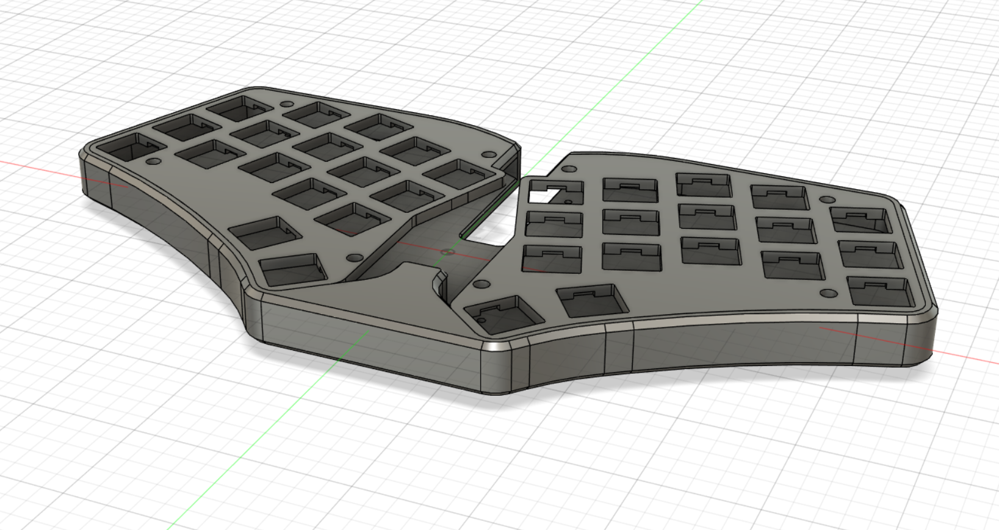
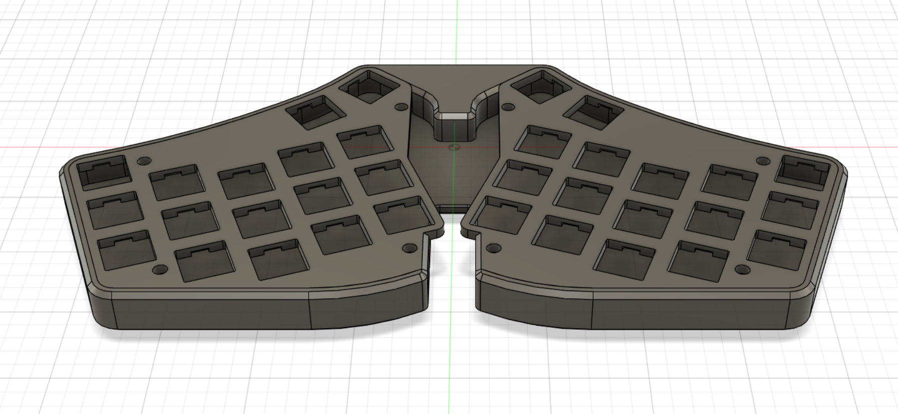

# cheapis-case
A case for the [Cheapis](https://github.com/dotleon/cheapis) by [@dotleon](https://github.com/dotleon)

ngl this case probably wont work ill write a better and less sarcastic readme once someone i know can print this case

oh btw you need [3mm standoffs and some screws (4mm?)](https://keeb.io/collections/diy-parts/products/m2-screws-and-standoffs) to screw the pcb to the case

Q&A:

Q: Will it work?

A: idk how about you find out yourself buddy

Q: Why won't you print it yourself?

A: im broke

Q: Can you at least show me what it looks like?

A: sure

